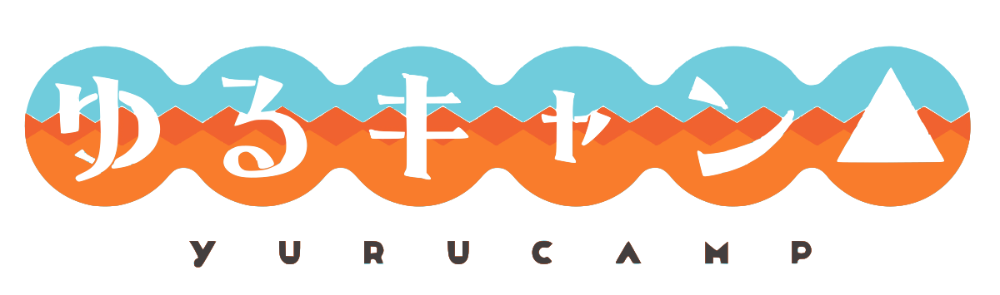

# ゆるキャン△

## 本編「ゆるキャン△」

オフシーズンの一人キャンプが好きな日本の女子高校生・志摩リン。リンが富士山の麓で冬の一人キャンプを楽しんでいたところ、日帰りのつもりが日没まで居眠りして遭難しかけていた同じ本栖高校の生徒・各務原なでしこを助ける。なでしこはリンのと出会いをきっかけにキャンプに興味を持つようになり、高校の同好会である「野外活動サークル（野クル）」に入部し、メンバーとも関わりながら、毎週のようにキャンプに出かけるようになり、皆とのキャンプに夢中になっていく。一方、仲間とつるんで行動するのが苦手なリンは、一緒に同好会に入らないかというなでしこの誘いを断るが、スマートフォンのSNSを介して、なでしこや野外活動サークルのメンバーと繋がりを持つようになり、互いにキャンプ中の状況を実況したり、キャンプ先の写真を送りあったりして関わるうち、徐々にキャンプ場の情報やキャンプ道具、野外調理に関するノウハウを交換したり、誘われたりして、時々ではあるが行動を共にするようになる。

## 志摩リン

主人公の一人。誕生日は10月1日。小学生に見間違われるなど小柄な体格をしており、腰まで伸ばした髪を頭の上で大きなシニヨンに結っている。祖父の影響もあり、キャンプを楽しむ性分。キャンプの経験は豊富なほうであるが、キャンプ場で静かに一人の時間を過ごすことに魅力を感じており、基本的に閑散とした冬季にしかキャンプをせず、誰かとキャンプした経験は皆無だった。

物語冒頭にて遭難しかけたなでしこを助け、時々なでしこともキャンプをするようになる。なでしことの出会いをきっかけにラーメン以上の本格的な野外調理にも手を出すようになり、運転免許を取得したばかりのスクーター「ヤマハ・ビーノ」で県境を越えた一人旅にも挑戦するようになる。原付に新しい部品をつけることもあるなど機械に対する技能もある。
本が大好きな図書委員であり、学校でもキャンプ先でも本を読んでいて、アルバイト先も書店。犬好き。いつもクールな態度を装っているが、決してコミュニケーションが苦手というわけではなく、また内心では常に周囲の事柄に対して悪態をついたり突っ込みを入れたりしている。やや天然でマイペースな傾向があり、どこか「知的な一匹狼キャラ」に徹しきれていない面もある。使っているキャンプ道具の多くは祖父・肇のお下がりで、愛用のテントはモンベル・ムーンライトテント3型。
千明からは「しまりん」と呼ばれている。なでしこや千明から幾度か野外活動サークルのメンバーに誘われているが、彼女らの活動に対しては「ノリが苦手」という印象を抱いており、やや距離を置いているものの、孤高という訳ではなく、メンバーとはLINEでやり取りもしており、次第に埋まりつつあるなど友達想いでもある。